# Consul-Envoy. Инструменты автоматизации

Использование инструментов автоматизации для провизии узлов.

## Содержание

1. [Удаленное конфигурирование узла через Ansible](#part-1-удаленное-конфигурирование-узла-через-ansible)
2. [Service Discovery](#part-2-service-discovery)
   
## Part 1. Удаленное конфигурирование узла через Ansible

Удаленная настройка узла для разворачивания мультисервисного приложения.

1) Создал с помощью [Vagrant](./Vagrantfile) три машины - manager, node01, node02. Использовал образ hashicorp-education/ubuntu-24-04.
Прокинул порты с node01 на локальную машину для доступа к пока еще не развернутому микросервисному приложению.

2) Подготовил manager как рабочую станцию для удаленного конфигурирования.
- Зашел на manager командой `vagrant ssh manager`. 

- На manager проверил подключение к node01 через ssh по приватной сети командой `ssh 192.168.11.22`. По умолчанию логин vagrant, пароль vagrant.

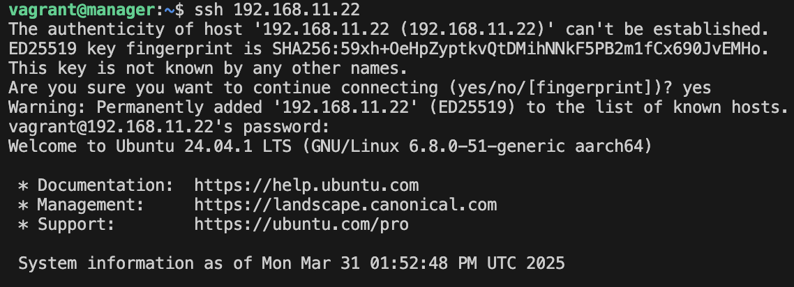

- Сгенерировал ssh-ключ для подключения к node01 из manager (без passphrase). Использовал команду `ssh-keygen -t ed25519`.

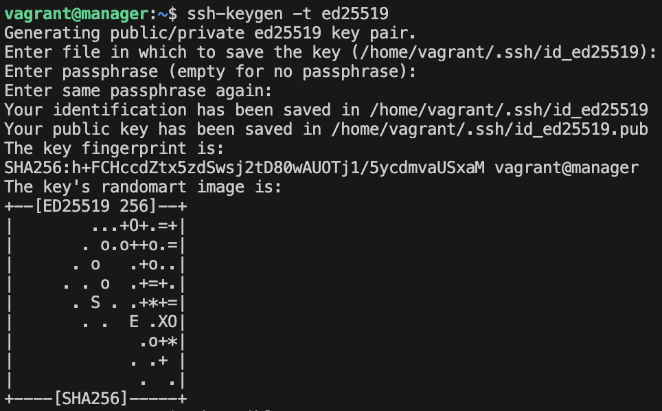

- Скопировал публичные ssh ключи на node01 и node02 командой `ssh-copy-id`.

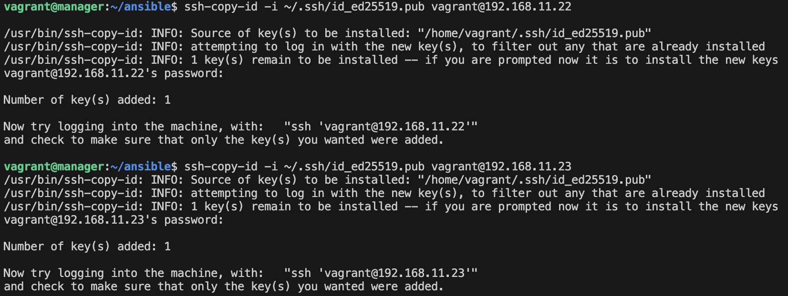

- Скопировал на manager [docker-compose.yml](./src/services/docker-compose.yml) файл и исходный код микросервисов. Скопировал их в общую папку `vagrant_shared` и синхронизировал командой `vagrant rsync`.

- Установил Ansible на менеджер командой `sudo apt install ansible` и создал папку `ansible`, в которой создал inventory-файл. 

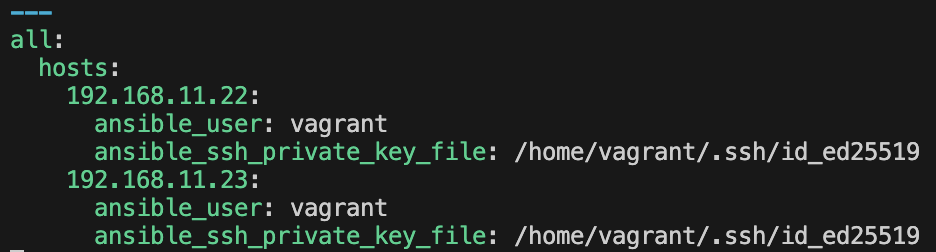

- Использовал модуль `ping` для проверки подключения через Ansible. Результат выполнения модуля:

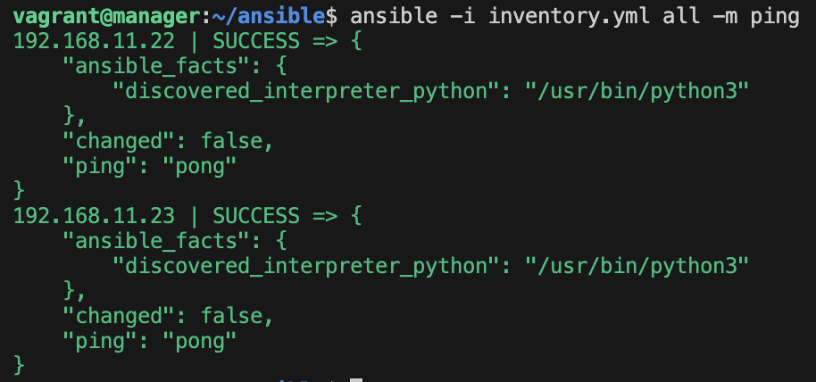

3) Написал первый плейбук для Ansible, который выполняет `apt update`, устанавливает `docker`, `docker-compose`, копирует compose-файл из manager'а и разворачивает микросервисное приложение. 

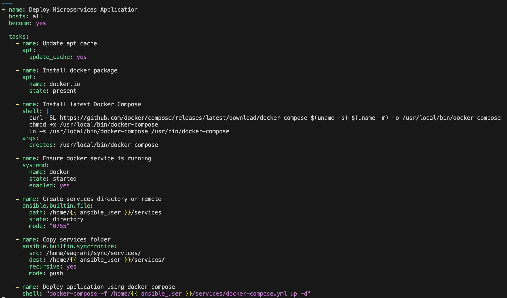

Запустил плейбук командой `ansible-playbook -i inventory.yml playbook.yml`.

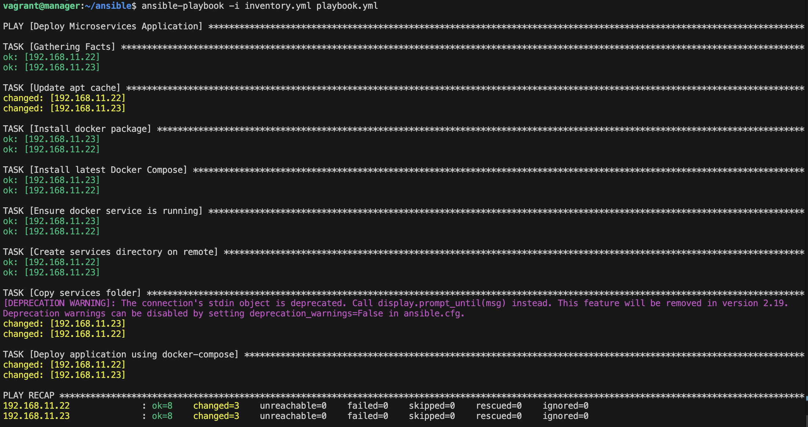

Все контейнеры запустились на обоих узлах.

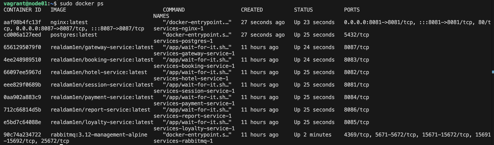

4) Прогнал заготовленные тесты через postman и удостоверился, что все они проходят успешно. В отчете отобразил результаты тестирования.

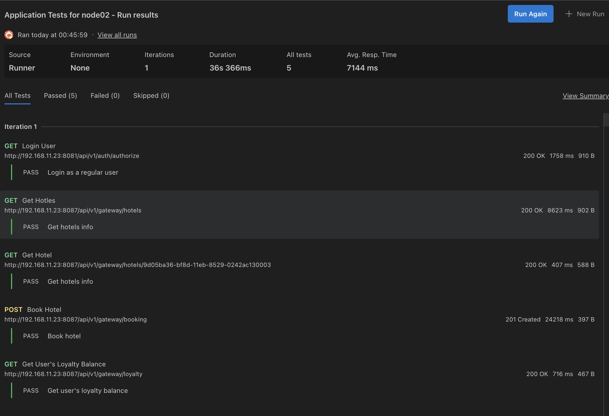

5) Сформировал три роли: 
 - роль application выполняет развертывание микросервисного приложения при помощи docker-compose;
 - apache устанавливает и запускает стандартный apache сервер;
 - postgres устанавливает и запускает postgres, создает базу данных с произвольной таблицей и добавляет в нее три произвольные записи;
 - Назначил первую роль node01 и вторые две роли node02, проверил postman-тестами работоспособность микросервисного приложения, удостоверился в доступности postgres и apache-сервера.

Результаты тестирования postman после выполнения этих ролей пройдены успешно.

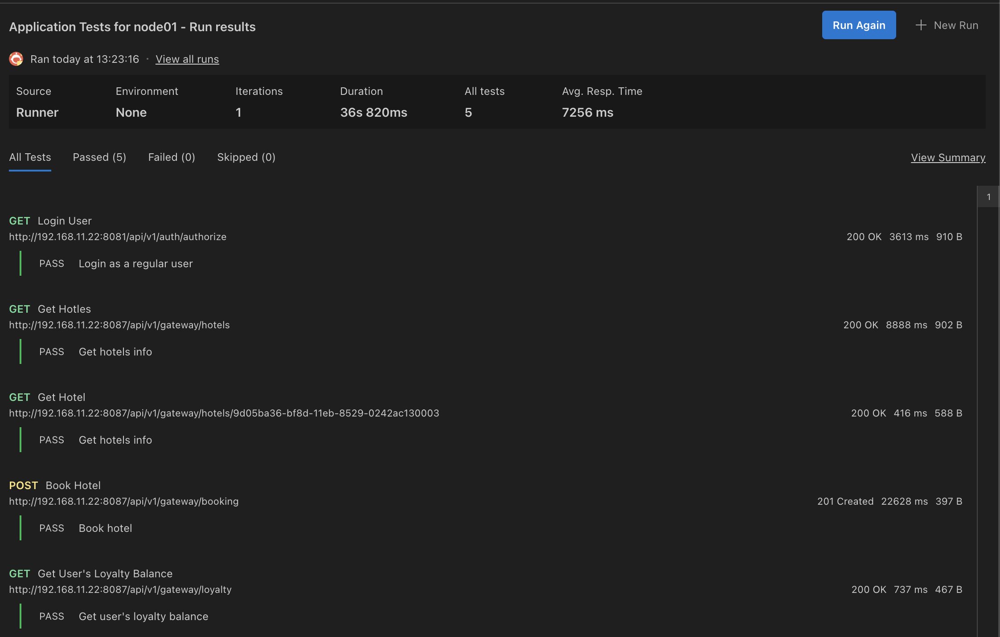 

Страница apache-сервера.

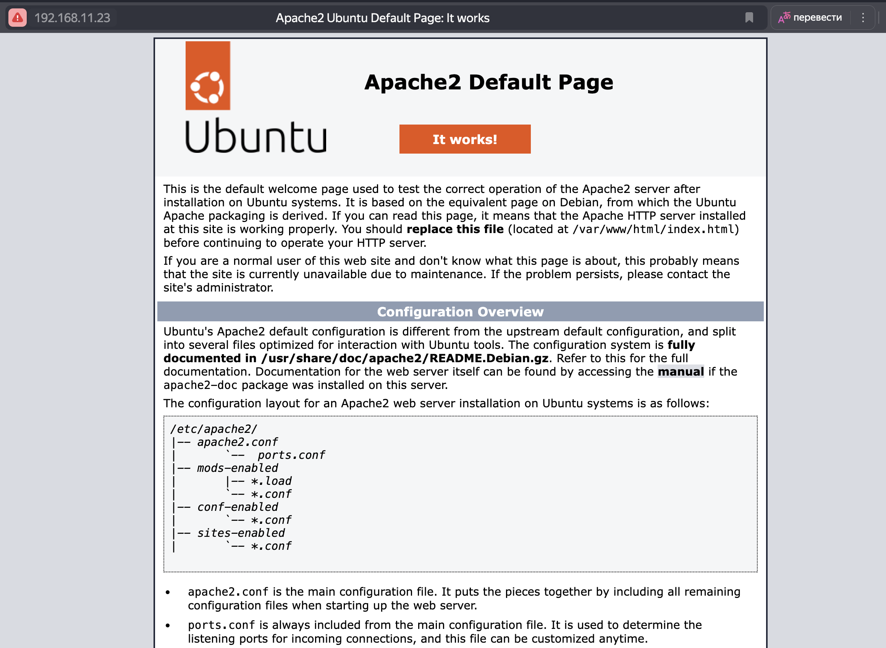

База данных с произвольной таблицей.

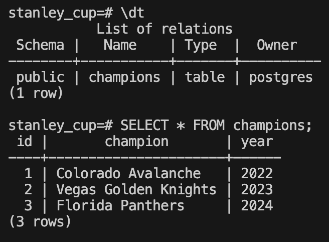

6) Созданные в этом разделе файлы разместил в папке `src/ansible01` в личном репозитории.

## Part 2. Service Discovery

Разворачивание двух удаленных сервисов - api и db, и осуществление между ними подключения через Service Discovery с использованием Consul.

1) Написал два конфигурационных файла для consul:
- [consul_server.hcl](./src/consul01/consul_server.hcl):
   - настроил агент как сервер;
   - указал в advertise_addr интерфейс, направленный во внутреннюю сеть Vagrant.
- [consul_client.hcl](./src/consul01/consul_client.hcl):
   - настроил агент как клиент;
   - указал в advertise_addr интерфейс, направленный во внутреннюю сеть Vagrant.

2) Создал с помощью Vagrant четыре машины - consul_server, api, manager и db. Написал [Vagrantfile](./Vagrantfile) на образе bento/ubuntu-22.04, потому что версия Ubuntu 24.04 не поддерживала работу Envoy Proxy.
- Прокинул порт 8082 с api на локальную машину для доступа к пока еще не развернутому api;
- Прокинул порт 8500 с server-consul для доступа к ui consul, хотя в задании был указан manager. Поскольку UI работает именно на сервере, считаю, что в задании была ошибка;
- Создал на manager ключ ssh и скопировал публичный ключ на оставшиеся хосты. По аналогии с первой частью задания;
- Установил ansible на manager.

3) Написал [плейбук](./src/ansible02/playbook.yml) для ansible и четыре роли: 
- install_consul_server, которая:
   - работает с consul_server;
   - копирует [consul_server.hcl](./src/consul01/consul_server.hcl);
   - устанавливает consul и необходимые для consul зависимости;
   - запускает сервис consul;
- install_consul_client, которая:
   - работает с api и db;
   - копирует [consul_client.hcl](./src/consul01/consul_client.hcl);
   - устанавливает consul, envoy и необходимые для consul зависимости; 
   - запускает сервис consul и consul-envoy;
- install_db, которая:
   - работает с db;
   - устанавливает postgres и запускает его;
   - создает базу данных `hotels_db`;
- install_hotels_service, которая:
   - работает с api;
   - копирует исходный код сервиса;
   - устанавлвиает `openjdk-8-jdk`;
   - создает глобальные переменные окружения:
      - POSTGRES_HOST="127.0.0.1"
      - POSTGRES_PORT="5432"
      - POSTGRES_DB="hotels_db"
      - POSTGRES_USER="postgres"
      - POSTGRES_PASSWORD="postgres"
   - запускает собранный jar-файл командой `java -jar /opt/hotels-service/target/*.jar`

> Из-за санкций Сonsul недоступен в России. Пришлось использовать VPN.

Для связки Consul-Envoy я использовал конфиги определения сервисов Consul Service Definition [db-proxy](./src/ansible02/roles/install_consul_client/files/db.json) и [api-proxy](./src/ansible02/roles/install_consul_client/files/api.json). Здесь сервисы объявляются и настраиваются через Consul, который уже запускает Envoy как sidecar-прокси. В итоге сервисы db и api соединяются друг с другом через прокси (Envoy).

Результат выполнения плейбука:

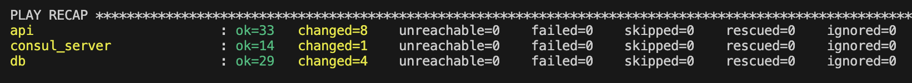

Веб-интерфейс Consul. Все сервисы успешно работают.

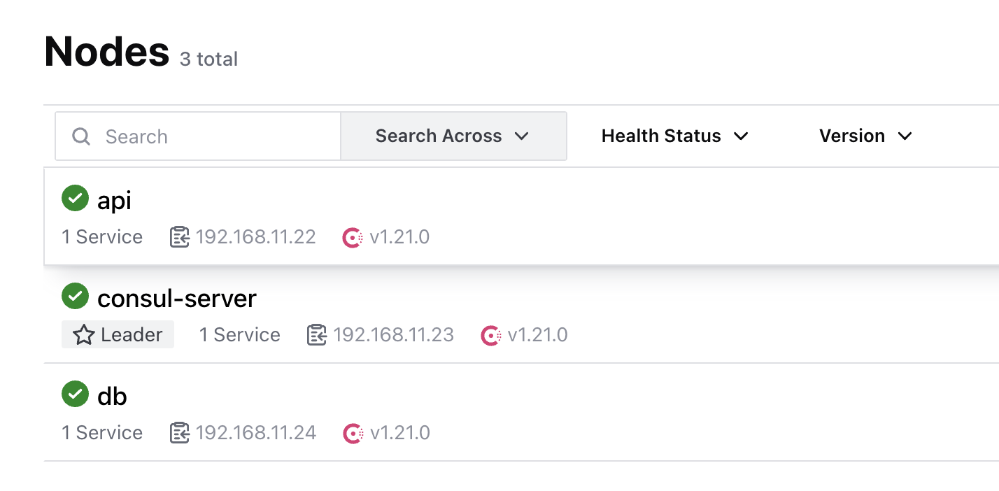

Настроенные сервисы sidecar-прокси.

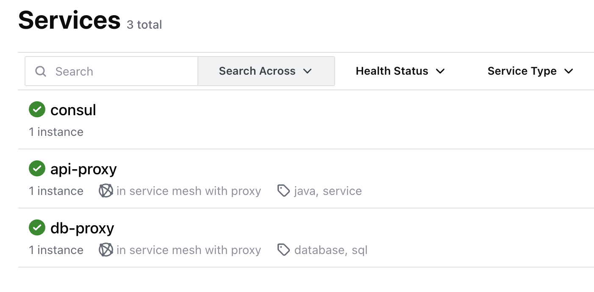

4) Проверил работоспособность CRUD-операций над сервисом отелей. 
   Из реализованных в коде есть только CREATE и READ. Методы UPDATE и DELETE не реализованы. Смог проверить лишь часть запросов. Остальные требуют подключения базы данных и других сервисов.

- Сервис успешно работает, есть доступ к API-интерфейсу.

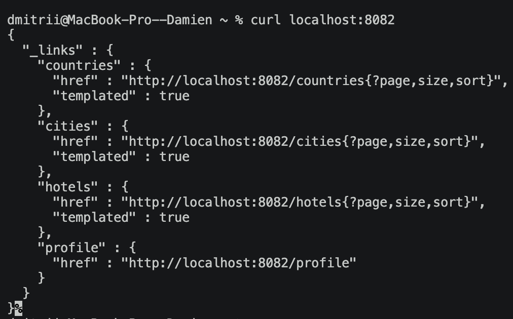

- Проверка метода CREATE. Добавил еще одну страну.

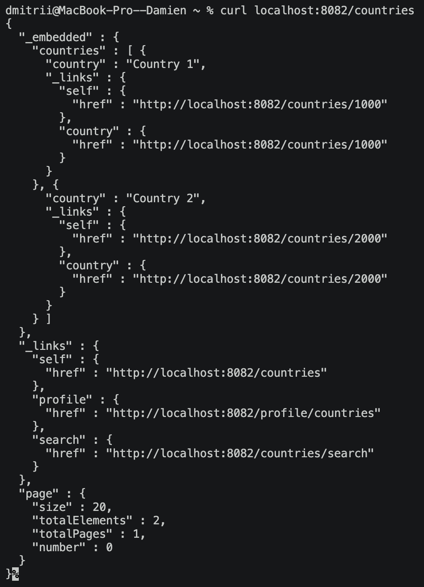
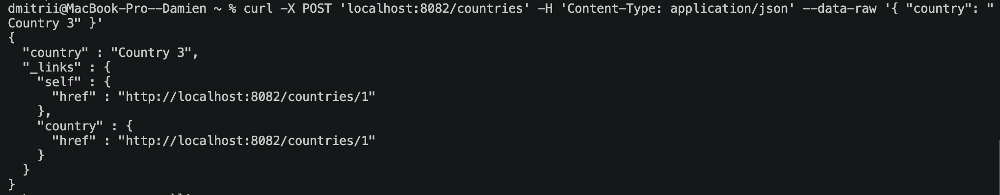
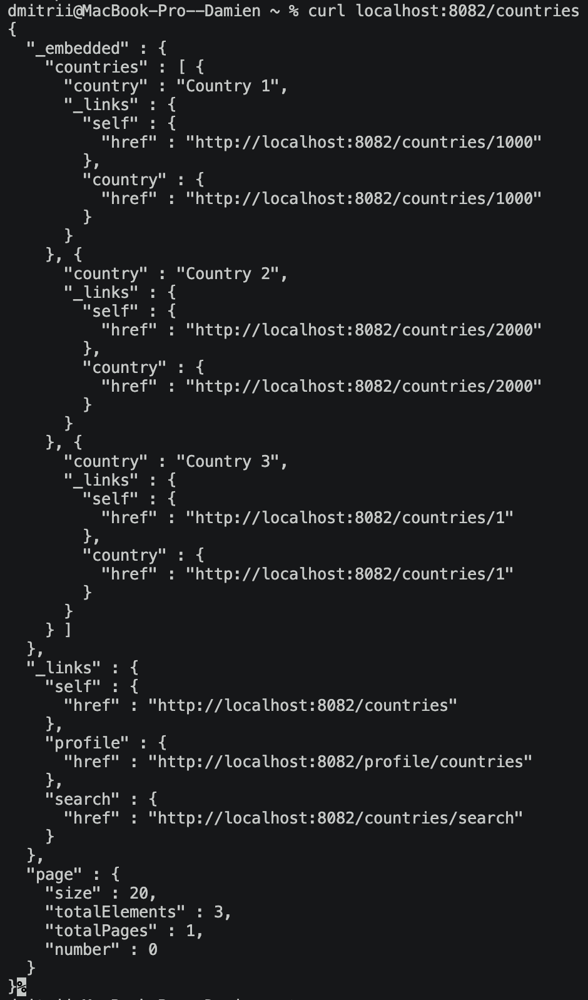

- Проверка метода READ. Получили данные.

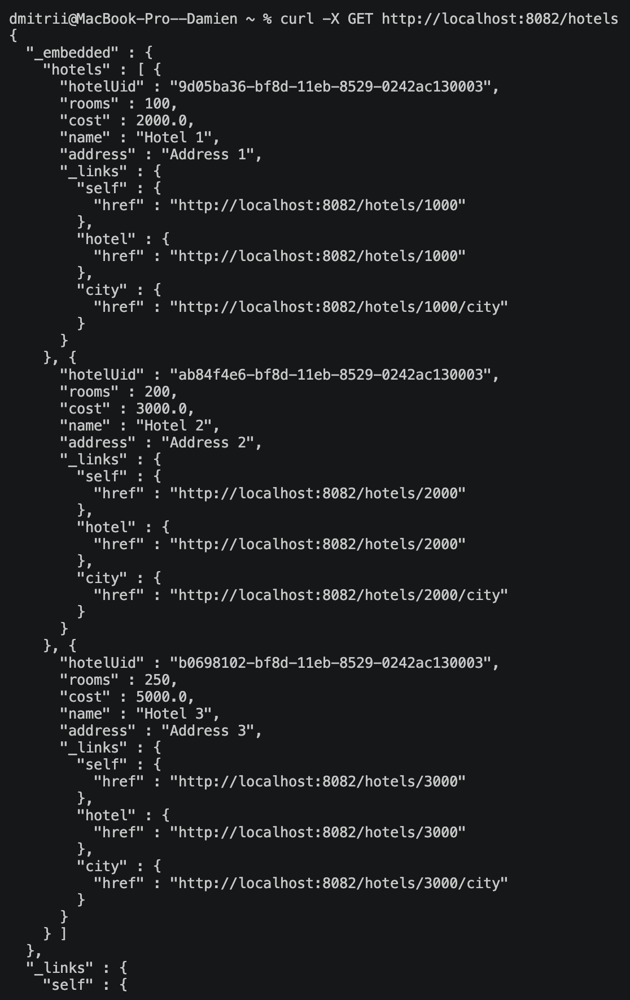

5) Созданные в этом разделе файлы разместил в папках `src/ansible02` и `src/consul01` в личном репозитории.

## Вывод

В ходе выполнения проекта я попрактиковался в  использовании инструментов автоматизации инфраструктуры: создавать и конфигурировать виртуальные машины с помощью Vagrant, настраивать удаленное развертывание приложений и сервисов с помощью Ansible (инвентарные файлы, плейбуки, роли), а также реализовывать сервисное обнаружение и проксирование взаимодействия между сервисами через Consul и Envoy sidecar proxy.

[К содержанию](#содержание)